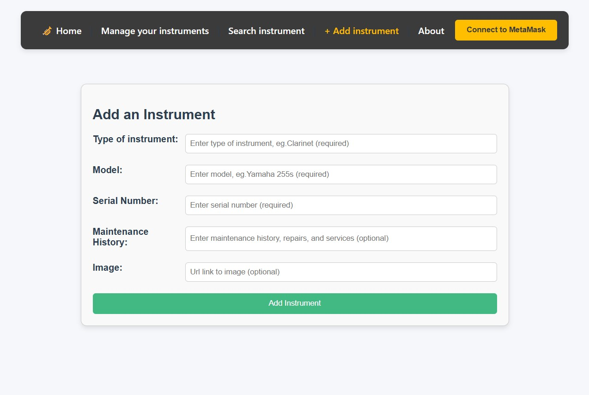
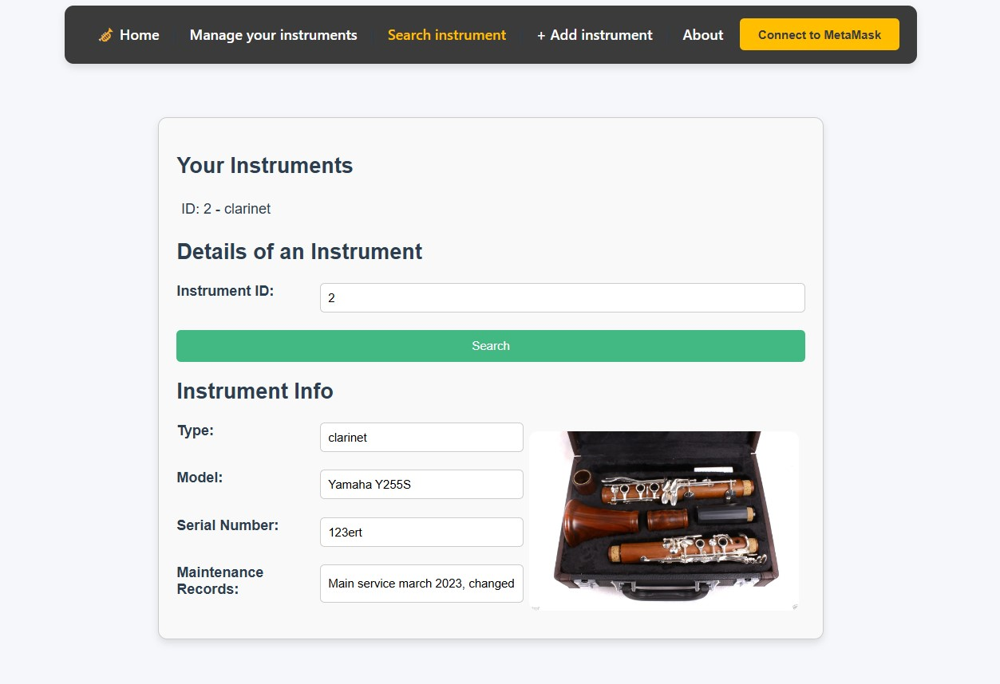
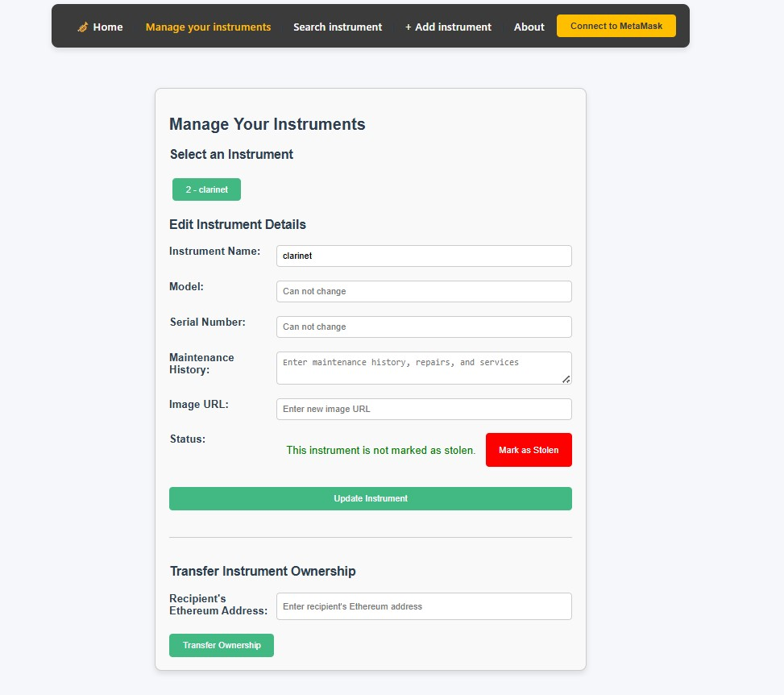
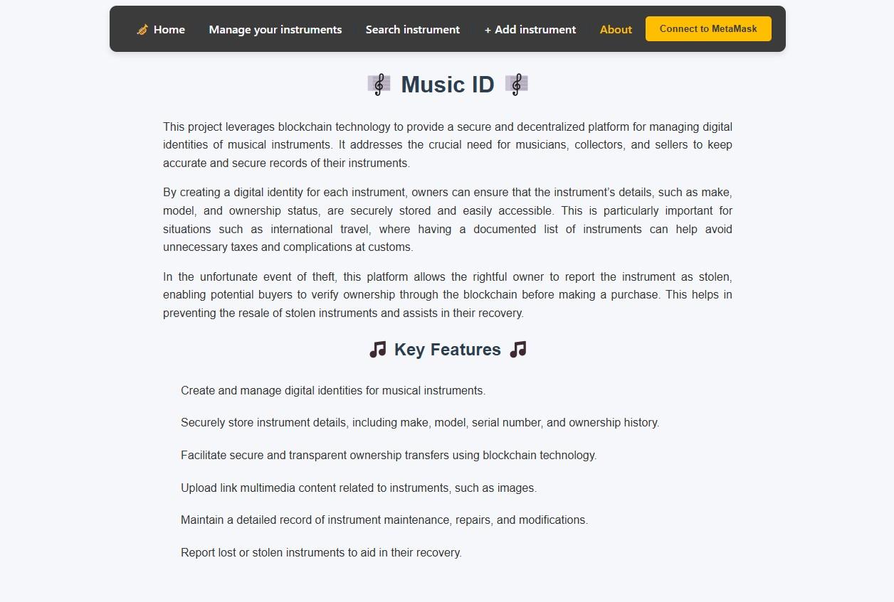

# MusicID

## Project setup

```
npm install
```

### Compiles and hot-reloads for development

```
npm run serve
```

### Compiles and minifies for production

```
npm run build
```

### Lints and fixes files

```
npm run lint
```

### Customize configuration

See [Configuration Reference](https://cli.vuejs.org/config/).

## App Screenshots

### 1. Home Page


### 2. Add New Instrument



### 3. Search Instrument and View Details



### 4. Edit Instrument and Transfer Ownership



### 5. About Page



### Customize configuration

See [Configuration Reference](https://cli.vuejs.org/config/).
